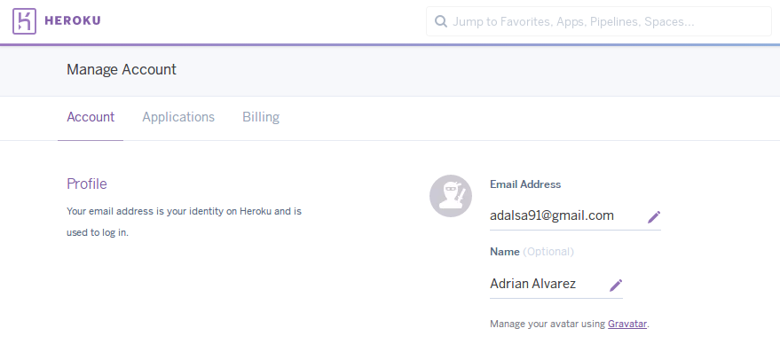
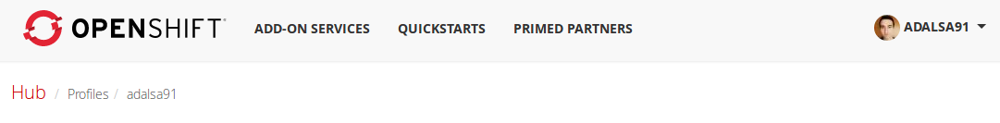
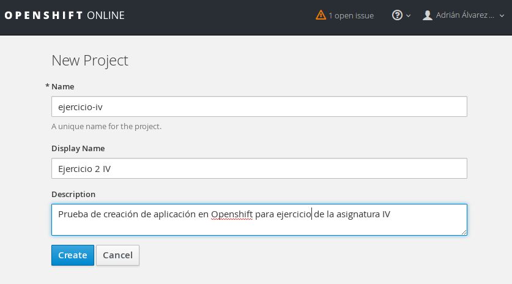
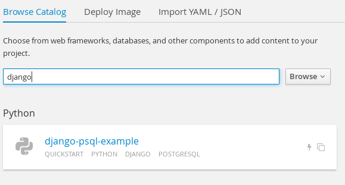
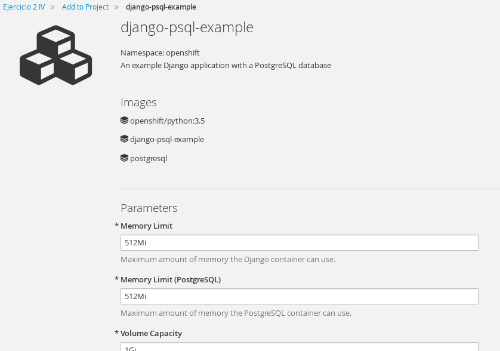
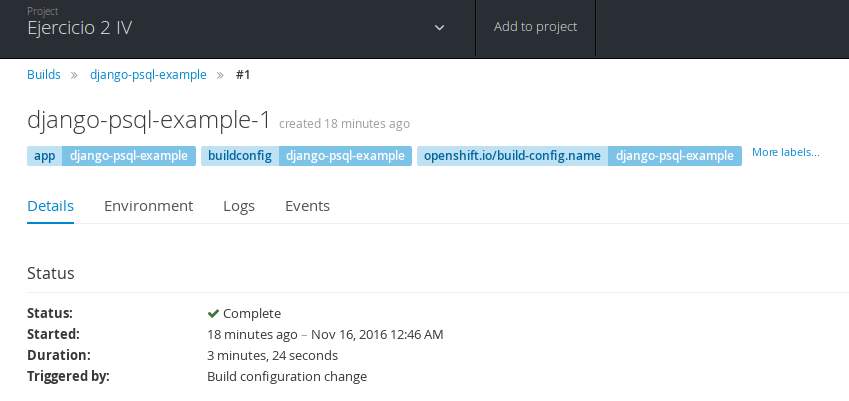
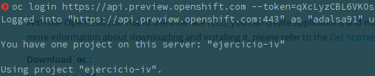

#Tema 3

##Ejercicio 1
###Darse de alta en algún servicio PaaS tal como Heroku, Nodejitsu, BlueMix u OpenShift.
Para la realización de este ejercicio me he dado de alta en Heroku y Openshift.





##Ejercicio 2
###Crear una aplicación en OpenShift o en algún otro PaaS en el que se haya dado uno de alta. Realizar un despliegue de prueba usando alguno de los ejemplos.
Para este ejercicio he utilizado OpenShift, para crear una aplicación accedemos a la [consola de Openshift](https://console.preview.openshift.com) y creamos un nuevo proyecto.



Una vez establecidos el nombre y descripción del proyecto, nos muestra una pantalla donde nos muestra un catalogo de aplicaciones que podemos usar. Elegimos por ejemplo una aplicación de ejemplo de Django.



A continuación nos muestra los detalles de la aplicación, en esta pantalla podemos modificar los prámetros como el límite de memoria prara Django y PostgreSQL.



Una vez creada la aplicación podemos ver su estado en la consola.



Para tener un mayor control de la administración de la aplicación instalamos las [herramientas de linea de comandos](https://console.preview.openshift.com/console/command-line) de Openshift.

```bash
    $ wget https://s3.amazonaws.com/oso-preview-docker-registry/client-tools/3.3/oc-3.3.0.35-1-linux.tar.gz
    $ tar -xf oc-3.3.0.35-1-linux.tar.gz
    $ sudo mv oc /usr/local/bin
```

Ahora procedemos a inicializar el CLI.




